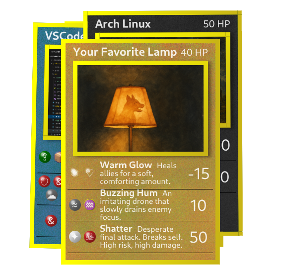

# Draggable Cards – React + Vite



https://gherghett.github.io/Draggable-Cards---React-Vite/

UI demo of draggable, animated cards — inspired by games like Pokémon or Magic: The Gathering.

Originally, this project was meant to help me learn **React** and try out **Vite** (first time using it). I quickly realized that this kind of per-frame DOM manipulation doesn’t naturally fit with how React handles state and rendering — but I made it work, and learned a lot in the process.

---

## 🔄 How It Works

- A handful of cards are rendered as **React components**.
- Each card can be **picked up and dragged** with the mouse or touch.
- Movement includes:
  - **Rotation based on movement speed**
  - **Z-index stacking**, so the most recently picked-up card appears on top
- Background images and some text are AI-generated.


---

## 💡 What I Learned

### 🧠 React + Dragging = Mismatch (At First)

React works best with state-driven UIs, but dragging is more like a **realtime physics problem** — it updates every frame and doesn't need to trigger re-renders.

At first, I tried putting all the drag logic into custom hooks with `useState` and `useEffect`, but realized hpw that could cause jank and performance issues.

### ✅ The Fix: A Global Controller

Instead of React-controlled state:
- I moved the drag logic to a plain **controller module** (`dragController.ts`)
- It registers **global mouse and touch listeners** once
- Individual cards just call `startDragging()` when grabbed
- DOM is updated **imperatively** (via `style.left`, `style.top`, `style.transform`)

This approach is more like vanilla JS — but it fits the problem.

---

## 🧩 Tech Stack

- [Vite](https://vitejs.dev/)
- [React](https://reactjs.org/)
- [TypeScript](https://www.typescriptlang.org/)
- Plain CSS (no libraries)

---

## 🚧 Known Limitations

- Cards are absolutely positioned — there's no layout manager or drop zones
- Touch support is basic but functional

---

## 🧪 To Try It

See the demo:
https://gherghett.github.io/Draggable-Cards---React-Vite/

install it yourself:
```bash
clone https://github.com/gherghett/Draggable-Cards---React-Vite
cd Draggable-Cards---React-Vite
cd Card-Vite

npm install
npx vite dev


